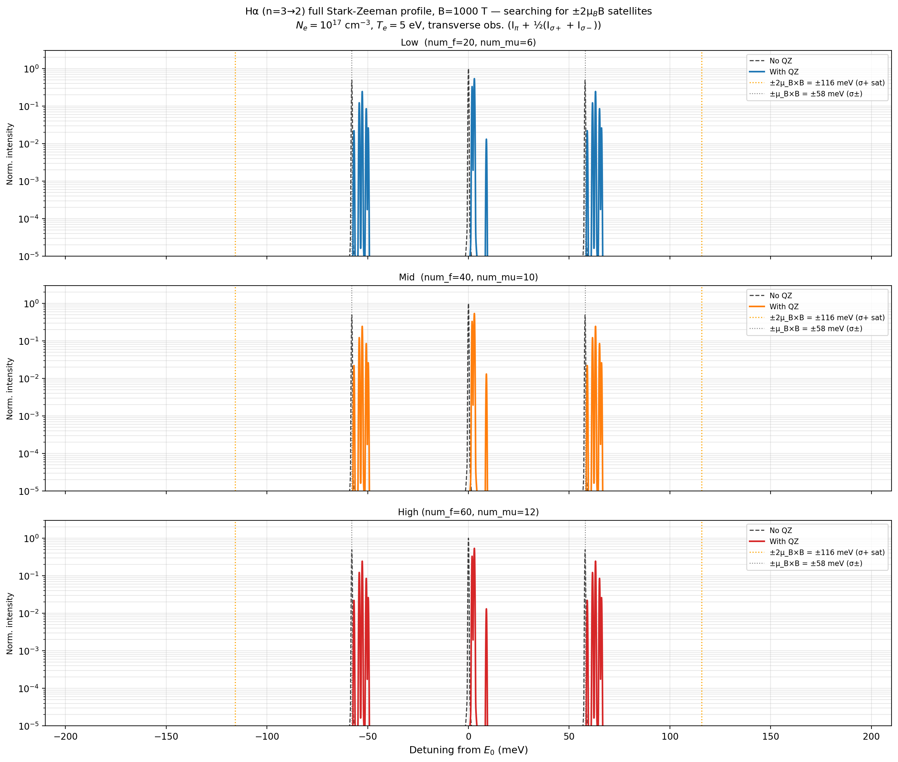
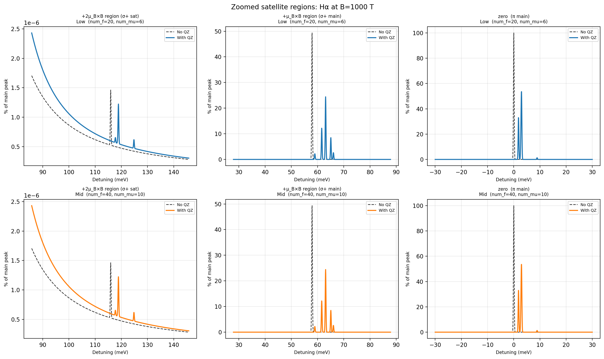

Satellite features at B = 1000 T
===================================

**Script:** ``examples/diag_halpha_satellites.py``

Searches for the :math:`\pm 2\mu_B B` Stark-Zeeman satellite feature in
Hα (n=3→2) at B = 1000 T, at three quadrature resolutions
(``num_f``/``num_mu`` = 20/6, 40/10, 60/12) to check convergence, both with
and without the quadratic Zeeman term.

.. note::

   This is an exploratory/diagnostic script, not a validated result: at the
   plasma conditions used here (:math:`N_e = 10^{17}` m\ :sup:`-3`,
   :math:`T_e = 5` eV) no distinctly resolved satellite peak is found at
   :math:`\pm 2\mu_B B` in the full-resolution profile — see the physical
   mechanism described in the script's docstring for the effect it was
   searching for. A companion script that claimed a specific ~2% satellite
   for Hβ (n=4→2) was found not to reproduce against the current solver and
   is intentionally not included here.

Code
----

.. literalinclude:: ../../../examples/diag_halpha_satellites.py
   :language: python
   :linenos:

Results
-------

   Full ±200 meV window at three quadrature resolutions, with and without
   quadratic Zeeman, marking the naive :math:`\pm\mu_B B` and
   :math:`\pm 2\mu_B B` positions.

   Zoomed views of the σ+ satellite region, the σ+ main-peak region, and the
   π line center, for the two lowest quadrature resolutions.
