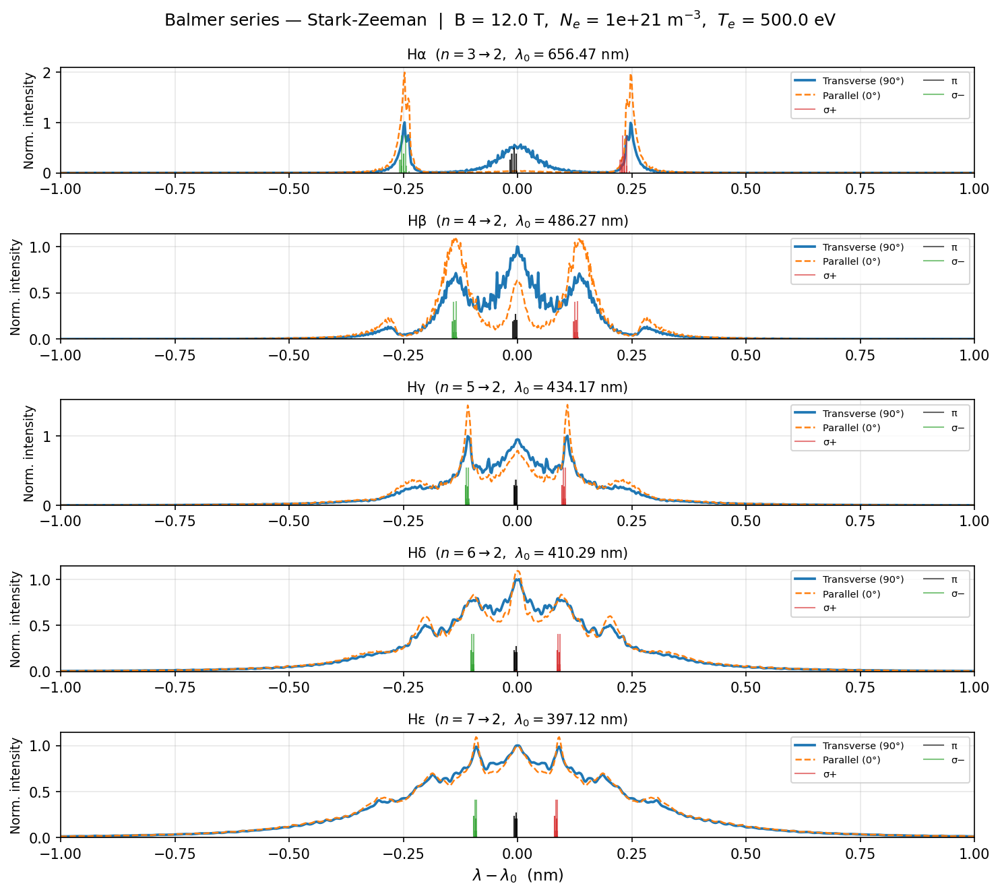

Balmer series — LineProfile class
====================================

**Script:** ``examples/example_balmer_lineprofile.py``

Computes Hα through Hε at DIII-D-like edge conditions (B = 12 T,
:math:`N_e = 10^{21}` m\ :sup:`-3`, :math:`T_e = 500` eV) using the
:class:`~starkzee.line_profile.LineProfile` class.  Each panel shows:

- Transverse (90°) and parallel (0°) broadened profiles
- Discrete stick spectrum at zero microfield (:math:`F = 0`)

The wavelength window is set by converting ±1 nm around each line center
to an energy grid.

Code
----

.. literalinclude:: ../../../examples/example_balmer_lineprofile.py
   :language: python
   :linenos:

Result
------

   Transverse and parallel broadened profiles with the zero-field stick
   spectrum overlaid, for Hα through Hε.
