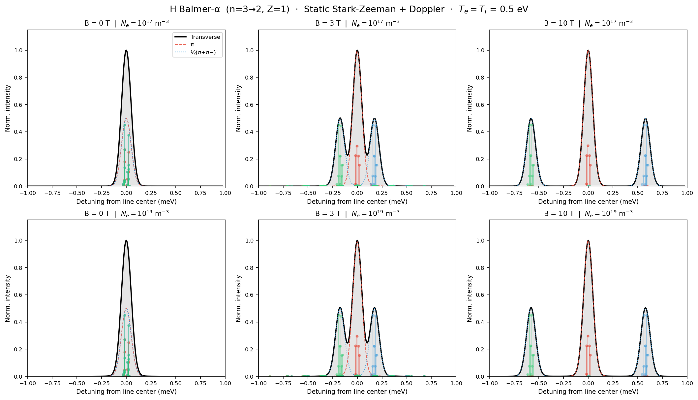

Hα stick spectrum and broadened profile
==========================================

**Script:** ``examples/example_halpha.py``

Side-by-side comparison of the discrete transition stick spectrum
(``discrete_transitions``) and the static Stark-Zeeman broadened profile
at B = 0, 3, and 10 T, at two electron densities
(:math:`N_e = 10^{17}` and :math:`10^{19}` m\ :sup:`-3`), showing the
transition from the Zeeman-dominated to the Stark-dominated regime.

Code
----

.. literalinclude:: ../../../examples/example_halpha.py
   :language: python
   :linenos:

Result
------

   Transverse profile (with π and ½(σ++σ−) components) and the zero-field
   stick spectrum overlaid, across a grid of B and :math:`N_e` values.
