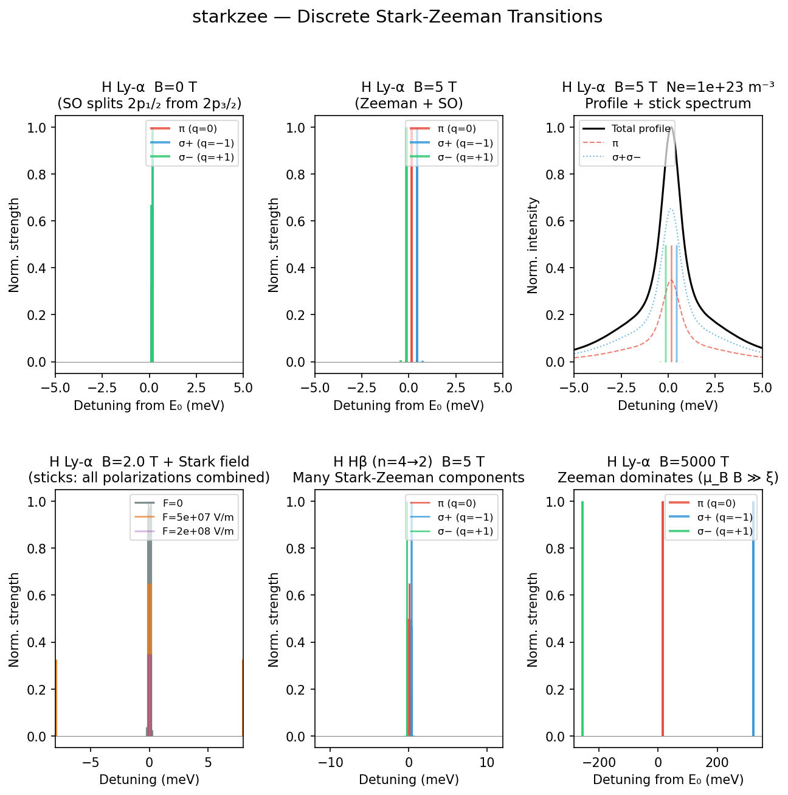

Transition anatomy
====================

**Script:** ``examples/example_transitions.py``

Explores the discrete Stark-Zeeman transitions of H Ly-α (n=2→1) and related
lines: prints a transition table with energies, polarizations, and dipole
strengths at B = 5 T, prints oscillator strengths and Einstein A coefficients
for a set of H lines, and builds a six-panel figure spanning:

1. Ly-α stick spectrum at B = 0 (fine-structure splitting only)
2. Ly-α stick spectrum at B = 5 T (Zeeman comparable to fine structure)
3. Full static profile with the B = 5 T stick spectrum overlaid
4. How a Stark field splits an otherwise degenerate B = 2 T manifold
5. Hβ (n=4→2) stick spectrum at B = 5 T — many Stark-Zeeman components
6. Ly-α at B = 5000 T — the Zeeman-dominated regime (:math:`\mu_B B \gg \xi`),
   completing the story set up by panels 1 and 2

Code
----

.. literalinclude:: ../../../examples/example_transitions.py
   :language: python
   :linenos:

Result
------

   From pure fine-structure splitting (B = 0) through Zeeman-comparable
   (B = 5 T) to Zeeman-dominated (B = 5000 T) regimes, plus Stark mixing and
   the denser Hβ manifold.
