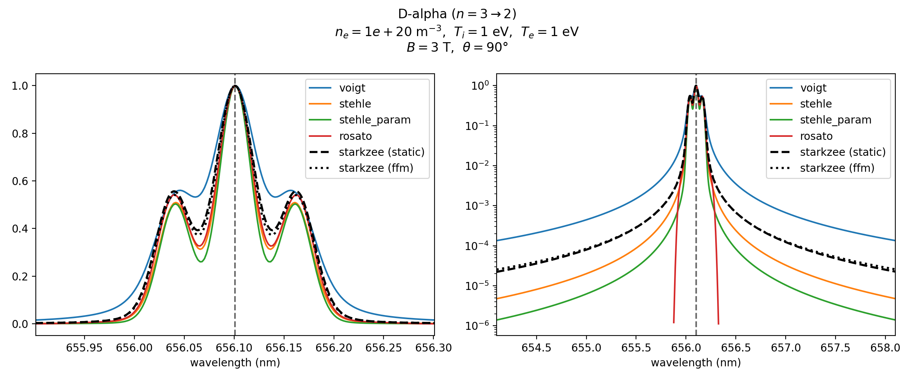
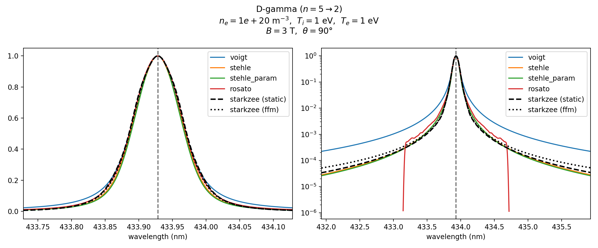

StarkZee vs. built-in reference models
=========================================

**Script:** ``examples/model_comparison.py``

Compares StarkZee's static and FFM (dynamic-ion) solvers against four
built-in reference models (Voigt, Stehlé, Stehlé-parameterized, Rosato). The
separate ``lomanowski`` sensitivity curve is disabled because its pseudo-mixture
is StarkZee-specific, whereas ``stehle_param`` is the direct Lomanowski
Eq. (1)/Eq. (2)/Table 1 parameterization. Both wrappers can add a separable
normal-Zeeman triplet; neither contains coupled Stark--Zeeman physics. The comparison is for D-α
(n=3→2) and D-γ (n=5→2) at :math:`N_e = 10^{20}` m\ :sup:`-3`, :math:`T_i = T_e = 1` eV,
:math:`B = 3` T, :math:`\theta = 90^\circ`. Uses
``use_empirical_data=True`` so both StarkZee solvers land on the measured
NIST line center (see :ref:`sec:empirical`) for a fair comparison against the
reference models, which are anchored to their own tabulated NIST air
wavelength. When given a path on the command line, the script saves D-α there
and D-γ beside it with a ``_dgamma`` suffix. The Rosato model and source tables
remain uncut by default; this example omits normalized Rosato plot values below
:math:`10^{-6}` of the peak without modifying the model output.

Code
----

.. literalinclude:: ../../../examples/model_comparison.py
   :language: python
   :linenos:

Result
------

   StarkZee (static and FFM) against the field-treating (Rosato) and
   field-free (Voigt, Stehlé, Stehlé-parameterized) reference models. Linear
   scale (left) and log scale (right).

   The same comparison for D-γ (:math:`n=5\to2`).
