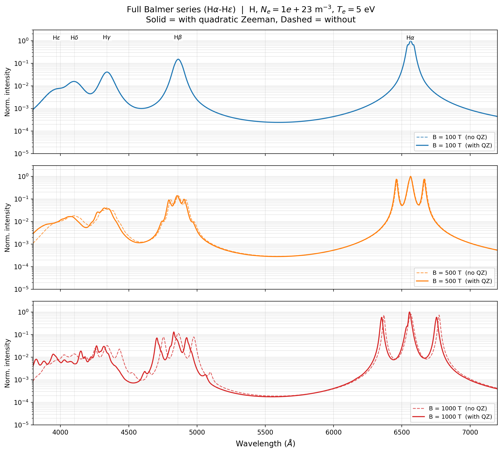

Reproducing Figure 1 from Ferri et al. (2022)
================================================

A script computing the full Balmer-series (Hα–Hε) Stark-Zeeman spectrum for
H, in the style of Figure 1 of Ferri, Peyrusse & Calisti (2022), at
B = 100, 500, 1000 T, comparing the profile with and without the quadratic
Zeeman term in the Hamiltonian. All five lines are summed on one common
wavelength grid (Case B recombination weighting) so the individual line
wings overlap into a single continuous spectrum.

.. note::

   This script is a **qualitative** illustration, not a quantitative
   reproduction of Ferri et al. Fig. 1. Ferri et al. build a
   configuration-interaction Hamiltonian mixing states of *different*
   principal quantum numbers, and note this inter-:math:`n` mixing is
   crucial for the quadratic Zeeman term at these field strengths.
   StarkZee currently diagonalizes the quadratic Zeeman (and Stark)
   Hamiltonian within a single principal shell only (see
   :doc:`../manual_approximations`); each Balmer line here is computed
   independently and the results are overlaid. In particular, the
   inter-:math:`n`-driven *red* shift of the high-PQN lines (Hβ, Hδ) that
   Ferri Fig. 1(c) shows at B = 1 kT is not reproduced — StarkZee's
   intra-shell treatment shifts these lines *blue* instead. See TODO item 1
   for the underlying analysis.

Full Balmer series (``reproduce_fig1.py``)
---------------------------------------------

.. literalinclude:: ../../../examples/reproduce_fig1.py
   :language: python
   :linenos:

   Hα–Hε summed on a common grid (Case B weighting) at B = 100, 500, 1000 T,
   solid = with quadratic Zeeman, dashed = without.
