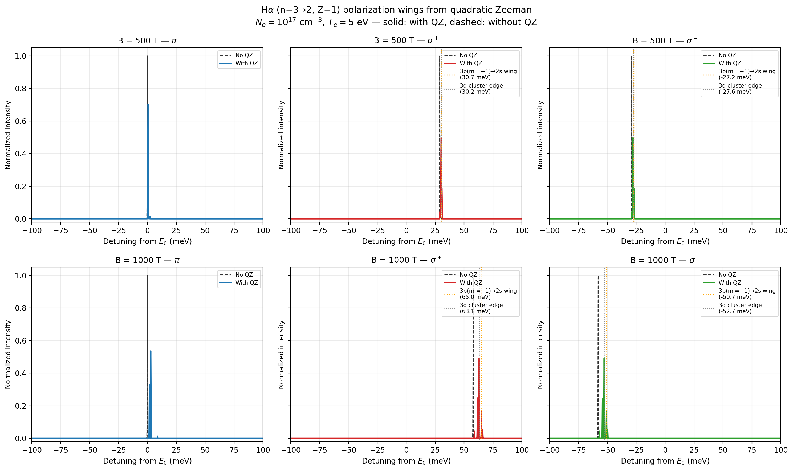

Quadratic Zeeman polarization wings
======================================

**Script:** ``examples/reproduce_halpha_wings.py``

Demonstrates the polarization-wing effect at B = 500 T and B = 1000 T: at
high field the quadratic Zeeman term shifts the
3p(:math:`m_l=\pm1`) → 2s transitions away from the main Hα cluster,
creating distinct shoulders/wings in the σ± components that only appear when
``quadratic_zeeman=True``. A modest ion temperature (``Ti_ev=Te``) is used so
the underlying Stark-Zeeman components — narrower than natural linewidth at
this low density — are resolved on the plotted grid rather than
undersampled.

Code
----

.. literalinclude:: ../../../examples/reproduce_halpha_wings.py
   :language: python
   :linenos:

Result
------

   π, σ+, σ− components at B = 500 T and B = 1000 T; solid = with quadratic
   Zeeman, dashed = without. The 3p→2s wing is resolved as a distinct
   shoulder at B = 1000 T.
