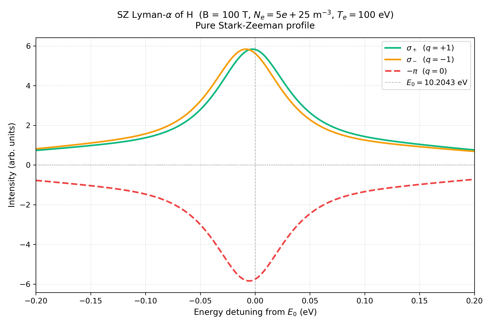
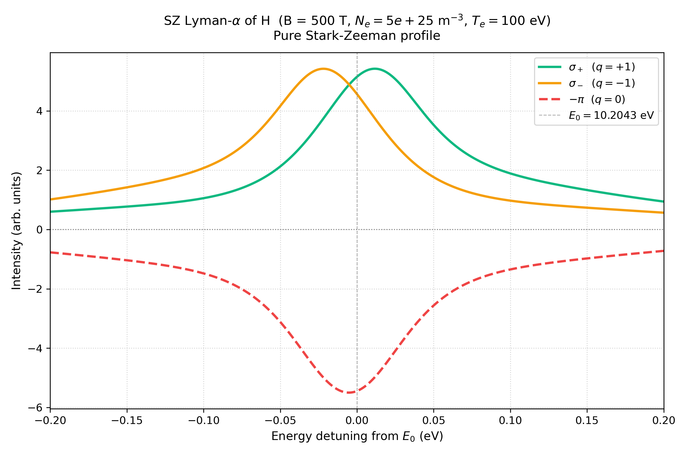
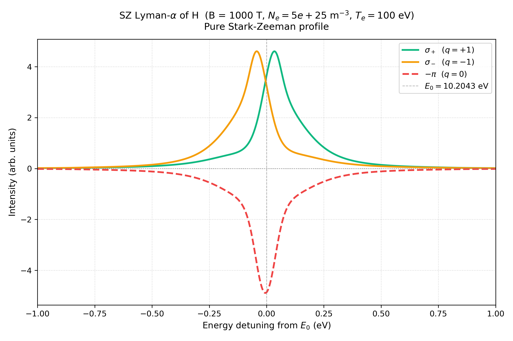

Lyman-α at high B
====================

Three scripts computing H Lyman-α (n=2→1) at increasing magnetic field —
100 T, 500 T, and 1000 T — exploring the transition from the
intermediate-field to the Paschen-Back regime. Conditions are
:math:`N_e = 5\times10^{25}` m\ :sup:`-3`, :math:`T_e = 100` eV throughout,
with no Doppler or instrumental convolution (pure Stark-Zeeman profile). Each
script's title is loosely inspired by Figure 3 of Ferri, Peyrusse & Calisti
(2022) — note that figure was computed for C VI (Z = 6), not H; these
scripts use H (Z = 1), so absolute splittings and widths differ from the
published figure.

B = 100 T (``test_lyman_alpha.py``)
--------------------------------------

.. literalinclude:: ../../../examples/test_lyman_alpha.py
   :language: python
   :linenos:

   π, σ+, σ− components of H Ly-α at B = 100 T (π shown inverted for visual
   separation).

B = 500 T (``test_lyman_alpha_500T.py``)
-------------------------------------------

.. literalinclude:: ../../../examples/test_lyman_alpha_500T.py
   :language: python
   :linenos:

   π, σ+, σ− components of H Ly-α at B = 500 T.

B = 1000 T (``test_lyman_alpha_1000T.py``)
---------------------------------------------

.. literalinclude:: ../../../examples/test_lyman_alpha_1000T.py
   :language: python
   :linenos:

   π, σ+, σ− components of H Ly-α at B = 1000 T.
