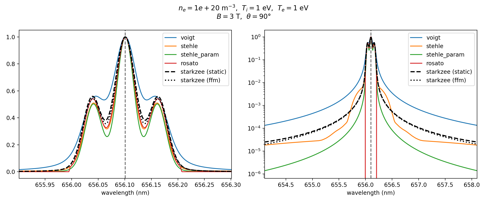

Built-in Reference Models
=================================

The ``starkzee.models`` package provides five independent lineshape models that share a common call signature and serve as benchmarks against StarkZee’s fully coupled solver. They are grouped into tabulated models (reading precomputed databases) and analytical models.

Tabulated Models
------------------------

Stehlé (MMM) — ``stehle``
^^^^^^^^^^^^^^^^^^^^^^^^^^^^^^^^^

The Stehlé model reads precomputed Stark lineshapes from the Model Microfield Method (MMM) database [stehle]_ for hydrogen Balmer and Paschen transitions over a grid of :math:`N_e` and :math:`T_e` values. The tables contain the *unmagnetized* (:math:`B = 0`) Stark + fine-structure profile as a function of a reduced detuning :math:`\Delta\omega/F_0` (Holtsmark normal field units). The pipeline is:

#. Bilinear interpolation over the :math:`(N_e, T_e)` table grid (with a Fortran-style three-point hyperbolic interpolator for the detuning axis).

#. Thermal Doppler broadening via FFT convolution.

#. Normal Zeeman splitting applied *after* the table: the whole Stark+Doppler profile is rigidly copied to :math:`\omega \pm \omega_L` (Larmor frequency) with angle-dependent :math:`\pi/\sigma` weights:

   .. math::

              I(\theta) = \sin^2\!\theta\,I_\pi + \tfrac{1+\cos^2\!\theta}{2}\,(I_{\sigma+} + I_{\sigma-})

The Stark and Zeeman effects are therefore treated as **separable**. This is valid only when the Zeeman splitting :math:`\mu_B B` is much smaller than the Stark width. Stehlé covers arbitrary :math:`(n_u, n_l)` and species with no restriction on :math:`B`-field value (it is simply ignored in the table lookup).

Rosato — ``rosato``
^^^^^^^^^^^^^^^^^^^^^^^^^^^

The Rosato database [rosato]_ solves the Stark-Zeeman problem *jointly* and tabulates the result with :math:`B` as an explicit table axis (:math:`B \in \{0, 1, 2, 2.5, 3, 5\}` T). The pipeline is:

#. Interpolation over the :math:`(N_e, T_e, B)` grid. The :math:`B`-interpolation is *scaled*: before blending two bracketing profiles at :math:`B_0` and :math:`B_1`, each profile’s detuning axis is stretched by :math:`B_\mathrm{node}/B`. This exploits the fact that Zeeman splitting scales linearly with :math:`B`, aligning the :math:`\sigma` components before interpolating.

#. Angle dependence from *two real tables* (parallel and perpendicular to :math:`\vec{B}`), blended as :math:`I = I_\parallel\cos^2\theta + I_\perp\sin^2\theta`. Both tables carry the correct :math:`\pi/\sigma` lineshape and width — the angle enters as a physical interpolation, not just an amplitude weight.

#. Thermal Doppler broadening via FFT convolution.

Rosato is restricted to deuterium Balmer lines and the table coverage :math:`N_e \in [10^{13}, 10^{16}]` cm\ :math:`^{-3}`, :math:`T_e \in [0.316, 31.6]` eV, :math:`B \le 5` T.

Analytical Models
-------------------------

Lomanowski — ``lomanowski``
^^^^^^^^^^^^^^^^^^^^^^^^^^^^^^^^^^^

Polynomial fits for the Stark FWHM from Lomanowski *et al.* [lomanowski]_:

.. math::

   \Delta\lambda_S = c_{n_u n_l}\,N_e^{a_{n_u n_l}}\,T_e^{-b_{n_u n_l}} \quad [\mathrm{nm}]

Coefficients :math:`(a, b, c)` are tabulated for H/D Balmer and Paschen lines up to :math:`n_u = 9`. A Voigt profile combines this Stark Lorentzian with a Doppler Gaussian. No magnetic field treatment.

Parameterized Stehlé — ``stehle_param``
^^^^^^^^^^^^^^^^^^^^^^^^^^^^^^^^^^^^^^^^^^^^^^^

An analytical parametric fit to the Stehlé tables, providing a fast closed-form approximation to the field-free Stark profile without reading the NetCDF database.

Voigt — ``voigt``
^^^^^^^^^^^^^^^^^^^^^^^^^

A pseudo-Voigt profile using the Griem :math:`\alpha_{12}` Stark half-width [griem]_ combined with thermal Doppler broadening. Serves as a quick estimate when only order-of-magnitude Stark width accuracy is required.

Comparison with StarkZee
--------------------------------

.. list-table:: Comparison with StarkZee
   :header-rows: 1
   :widths: 22 30 25 23

   * - Feature
     - StarkZee
     - Stehlé
     - Rosato
   * - Magnetic field
     - Full simultaneous diagonalization of :math:`H = H_A + V_E`
     - :math:`B = 0` in tables; added as rigid triplet after
     - :math:`B` is a table axis
   * - Fine structure
     - Yes — spin-orbit, MV, Darwin
     - No (degenerate hydrogenic)
     - In tables
   * - Electron broadening
     - GBK semi-classical, frequency-dependent
     - Unified theory (more rigorous far wings)
     - In tables
   * - Ion dynamics
     - Quasi-static + optional FFM
     - Static + some ion-dynamics treatment
     - In tables
   * - Microfield
     - Hooper screened
     - Holtsmark/Hooper variant
     - Holtsmark variant
   * - :math:`B`-treatment
     - Intrinsic to Hamiltonian
     - External convolution
     - :math:`B`-scaled interpolation

The most important physical distinction at :math:`B \ne 0`: StarkZee diagonalizes :math:`H = H_A + V_E` *simultaneously* for all field strengths. When :math:`\mu_B B \sim 3n\,e\,a_0\,F` (Zeeman and Stark splitting comparable) the eigenstates are genuine Stark-Zeeman hybrids — neither pure Zeeman nor pure Stark states. No post-processing convolution can reproduce this mixing. The separable approximation (Stehlé) and scaled-interpolation approach (Rosato) both become inaccurate in this regime.

   StarkZee (static and FFM) compared against four built-in reference models
   (Lomanowski has no magnetic-field treatment and is disabled in this
   comparison) for D\ :math:`_\alpha` (:math:`n=3\to2`) at
   :math:`N_e = 10^{20}` m\ :sup:`-3`, :math:`T_i = T_e = 1` eV, :math:`B = 3` T,
   :math:`\theta = 90^\circ`. Linear scale (left) and log scale (right). The
   field-free models (Voigt, Stehlé, Stehlé-parameterized) collapse the Zeeman
   triplet into a single unsplit line, while StarkZee and Rosato — which both
   treat :math:`B` intrinsically — resolve the :math:`\pi/\sigma^\pm` splitting.
   Generated by ``examples/model_comparison.py``.

